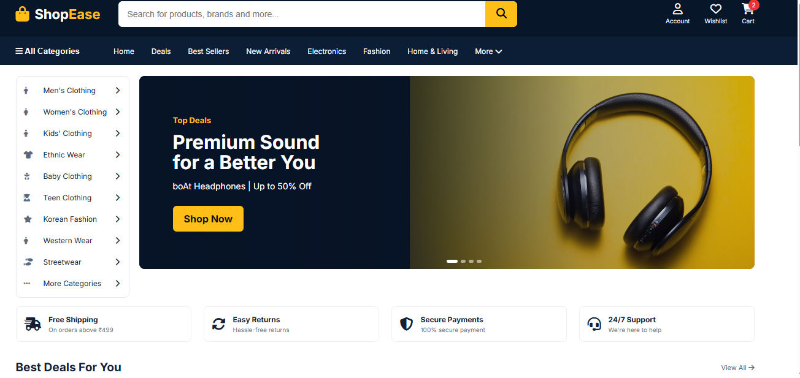

# PATEL MALL

PATEL MALL is a responsive clothing-shopping marketplace built with Flask and
MySQL. It brings clothing styles for babies, kids, teens and adults together
in one place, including Korean-inspired fashion, western wear, streetwear and
ethnic collections.

Shoppers can browse the catalog, search by product name, brand or category,
open product pages with related styles, add items to a cart, and proceed
through an address and payment-method checkout flow. The demo catalog contains
59 clothing products. Checkout supports UPI, card and cash-on-delivery method
selection; a payment gateway is not integrated.

## Screenshots

### Storefront



### Clothing products


## Highlights

- Browse age-based and style-based clothing categories.
- Search products by name, brand or category, with live suggestions and up to
  12 relevant results.
- View product details and related items from the same clothing style.
- Add products to the cart, change quantities, and remove items.
- Create an account and sign in; passwords are stored as hashes.
- Enter a delivery address, select a payment method and place an order.
- Review previous orders.
- Responsive layouts for desktop and mobile screens.

## Technology

- Python and Flask
- MySQL with `mysql-connector-python`
- HTML templates with Jinja
- CSS and JavaScript

## Requirements

- Python 3.10 or newer
- MySQL Server
- MySQL Workbench (recommended for setting up the database)
- Git (optional)

## Setup on Windows

Open Command Prompt in the project directory:

```cmd
cd /d D:\amazon_project
python -m venv venv
venv\Scripts\activate.bat
pip install -r requirements.txt
```

In MySQL Workbench, connect to your local MySQL server and run the full
[`schema.sql`](./schema.sql) script to create `shopease_db`, its tables,
categories and sample catalog.

Set the MySQL password in the same Command Prompt window before starting the
app. Replace `root` with your MySQL password if it is different:

```cmd
set DB_PASSWORD=root
python app.py
```

Open **http://127.0.0.1:5002** in your browser. Keep the Command Prompt window
open while using the app; press `Ctrl+C` there to stop the Flask server.

The database connection can also be configured with `DB_HOST`, `DB_PORT`,
`DB_USER`, `DB_PASSWORD` and `DB_NAME` environment variables. Defaults are
`127.0.0.1`, `3306`, `root`, an empty password and `shopease_db`, respectively.

## Project structure

```text
app.py                 Flask routes and shopping flows
database.py            MySQL connection settings
schema.sql             Database schema and sample clothing catalog
templates/             Jinja pages for the storefront and account flows
static/css/style.css   Storefront styles and responsive layout
static/js/script.js    Search suggestions and cart interactions
requirements.txt       Python dependencies
```
